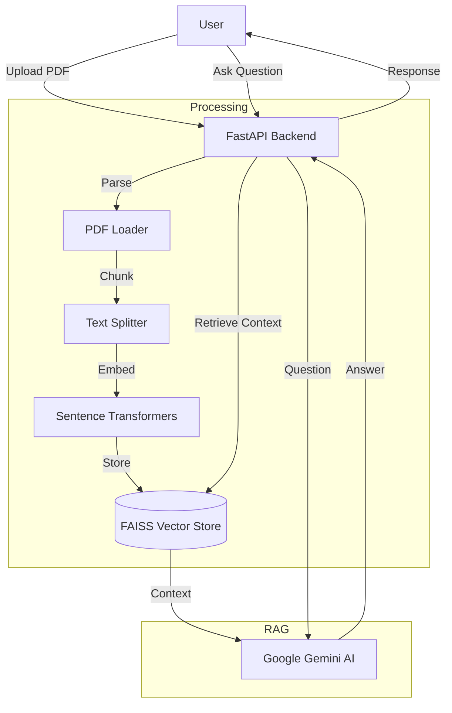

# AskNova 🚀

[](https://fastapi.tiangolo.com/)
[](https://ai.google.dev/)
[](https://python.langchain.com/)
[](https://github.com/facebookresearch/faiss)

**AskNova** is a high-performance AI assistant designed for researchers, students, and professionals to interact directly with PDF research papers. Built on the Google Gemini AI and leveraging fast vector search, AskNova enables natural language queries on dense technical documents with unparalleled speed.

---

## 🛠️ Features

* **PDF Upload**: Seamlessly ingest research papers in PDF format.
* **Natural Language Q&A**: Ask complex questions and get precise answers derived directly from the text.
* **Lightning Fast**: Get answers in **~2 seconds**, reducing time spent scrolling through documents.
* **Persistent Storage**: Vector embeddings are stored locally, ensuring fast subsequent queries without re-processing.

---

## 🧠 Why RAG (Retrieval-Augmented Generation)?

Unlike a standard LLM chatbot that relies on its training data (which might be outdated or incorrect), **AskNova uses RAG to ensure accuracy.**

1.  **Retrieval**: When you ask a question, the app searches through your uploaded document to find the most relevant chunks of text.
2.  **Augmentation**: Those relevant chunks are sent to the LLM (Gemini) along with your question.
3.  **Generation**: The LLM generates an answer based **only** on the context provided.

### 🚫 Anti-Hallucination Guardrail
Because the LLM is restricted to the text in your document, it cannot fabricate information. If the answer is not in the document, it will tell you, ensuring trustworthy results for technical research.

---

## 🏗️ Architecture




---

# 📦 Installation & Setup

## ✅ Prerequisites

- Python 3.10+
- Google Gemini AI API Key (get one from Google AI Studio)

---
## 🛠️ Technology Stack
# Backend
* FastAPI - Modern, fast web framework
* Sentence Transformers - Text embedding models
* FAISS - Vector similarity search
* LangChain - Text splitting utilities
* pdfplumber - PDF text extraction
* Google Gemini API - AI language model

# Frontend

* Vanilla JavaScript - No frameworks, pure JS
* CSS3 - Modern styling with gradients
* HTML5 - Semantic markup

# DevOps

* Docker - Containerization
* Railway/Render - Cloud deployment(coming soon)

--- 
## ⚙️ Setup Steps

### 1️⃣ Clone the Repository

```bash
git clone https://github.com/yourusername/asknova.git
cd asknova

```
---
# Install Dependencies
```bash
pip install -r requirements.txt
```
# Run the Application
```bash
uvicorn main:app --reload
```
## App runs at:
```bash
http://localhost:8000
```
---

# Future Scopes
* Multi-document search
* Dark mode
* Mobile responsive design
* Support for DOCX, EPUB
* Multi-language support
* Team collaboration
* API rate limiting
* User authentication
* Analytics dashboard
